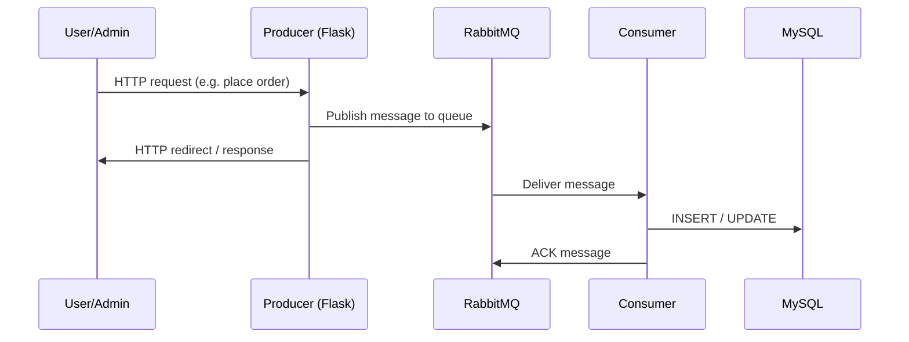

# Inventory Management System

A microservices-based inventory management application built with **Flask**, **RabbitMQ**, and **MySQL**, fully containerized with **Docker Compose**. The system separates the web UI (producer) from background processing (consumers) using an asynchronous message queue, enabling scalable and decoupled inventory, order, and health-check workflows.

---

## Table of Contents

- [Features](#features)
- [Tech Stack](#tech-stack)
- [High-Level Design (HLD)](#high-level-design-hld)
- [Architecture Components](#architecture-components)
- [Message Queue Design](#message-queue-design)
- [Database Schema](#database-schema)
- [Project Structure](#project-structure)
- [Getting Started](#getting-started)
- [Application Routes](#application-routes)
- [Default Credentials](#default-credentials)
- [Service Ports](#service-ports)

---

## Features

| Role | Capabilities |
|------|-------------|
| **User** | Login, browse inventory, place orders, view order history |
| **Admin** | Add new inventory items, restock existing products, view all orders, update order status (shipped/cancelled), trigger consumer health checks |

**System capabilities:**
- Asynchronous order and inventory updates via RabbitMQ
- Four dedicated consumer services for item creation, stock management, order processing, and health monitoring
- Docker-based deployment with isolated services
- Session-based authentication for users and admins

---

## Tech Stack

| Layer | Technology |
|-------|------------|
| Web framework | Flask (Python) |
| Message broker | RabbitMQ 3 (with Management UI) |
| Database | MySQL |
| ORM / DB driver | mysql-connector-python (raw SQL) |
| Messaging client | pika |
| Frontend | Jinja2 templates + Bootstrap 4/5 |
| Containerization | Docker, Docker Compose |

---

## High-Level Design (HLD)

### System Context

The application follows a **producer–consumer** pattern. The Flask web app acts as the **producer**: it accepts HTTP requests from users/admins and publishes work to RabbitMQ queues. Four **consumer** services listen on dedicated queues and perform database writes asynchronously.

```
┌─────────────────────────────────────────────────────────────────────────────┐
│                              CLIENT (Browser)                                │
└───────────────────────────────────┬─────────────────────────────────────────┘
                                    │ HTTP
                                    ▼
┌─────────────────────────────────────────────────────────────────────────────┐
│                         PRODUCER (Flask Web App)                             │
│  Routes: login, dashboard, buy, admin, order_history, add_stock, health     │
│  Port: 5000                                                                  │
└───────────────┬─────────────────────────────────────┬─────────────────────────┘
                │ Publish messages                     │ Read (sync queries)
                ▼                                      ▼
┌───────────────────────────────┐         ┌───────────────────────────────────┐
│      RABBITMQ BROKER          │         │         MySQL DATABASE           │
│  Queues:                      │         │  Tables: inventory, orders,      │
│  • itemcreation               │         │          users, admins, health     │
│  • stockmanagement            │         │  Port: 3307 (host) → 3306 (container)│
│  • orderprocessing            │         └───────────────────────────────────┘
│  • healthcheck                │                      ▲
│  Port: 5672 / 15672 (mgmt)    │                      │
└───────────────┬───────────────┘                      │
                │ Consume                                │ Write
                ▼                                        │
┌───────────────────────────────────────────────────────┴─────────────────────┐
│                            CONSUMER SERVICES                                 │
│  ┌─────────────┐ ┌─────────────┐ ┌─────────────┐ ┌─────────────┐            │
│  │ Consumer 1  │ │ Consumer 2  │ │ Consumer 3  │ │ Consumer 4  │            │
│  │ healthcheck │ │ itemcreation│ │stockmgmt    │ │orderprocess │            │
│  └─────────────┘ └─────────────┘ └─────────────┘ └─────────────┘            │
└─────────────────────────────────────────────────────────────────────────────┘
```

### Request Flow (Sequence)



### Design Principles

1. **Decoupling** — The web layer does not perform heavy or transactional inventory logic directly; it delegates to consumers via queues.
2. **Single responsibility** — Each consumer handles one domain: items, stock, orders, or health.
3. **At-least-once delivery** — Consumers use manual acknowledgment (`auto_ack=False`); stock consumer requeues on insufficient inventory (`basic_nack` with `requeue=True`).
4. **Health monitoring** — A dedicated health-check flow resets consumer status in the DB and pings each worker queue to verify liveness.

---

## Architecture Components

### 1. Producer (`producer/`)

Flask application serving the UI and API endpoints.

- Connects to MySQL for **read** operations (inventory listing, order history, login validation).
- Publishes **write** operations to RabbitMQ instead of updating the database directly.
- Declares four queues on startup: `healthcheck`, `stockmanagement`, `orderprocessing`, `itemcreation`.
- Uses Flask sessions for user/admin authentication.

### 2. RabbitMQ (`rabbitmq/`)

Message broker based on `rabbitmq:3-management`.

- Default credentials: `user` / `password`
- AMQP port: `5672`
- Management UI: `15672`

### 3. Database (`database/`)

MySQL container initialized via `init.sql`.

- Database: `mydatabase`
- User: `myuser` / `password`
- Seeds sample inventory, users, admins, and health records on first run.

### 4. Consumers

| Service | Queue | Responsibility |
|---------|-------|----------------|
| **consumer_one** | `healthcheck` | On trigger, marks all consumers as "Not Active", then publishes health pings to `stockmanagement`, `orderprocessing`, and `itemcreation` queues |
| **consumer_two** | `itemcreation` | Creates new inventory rows OR increments stock for existing products |
| **consumer_three** | `stockmanagement` | Processes purchase orders: validates stock, decrements inventory, creates order record |
| **consumer_four** | `orderprocessing` | Updates order status (e.g. shipped, cancelled) |

---

## Message Queue Design

### Queue: `itemcreation`

| Message format | Fields | Action |
|----------------|--------|--------|
| New product | `product_name quantity unit_price location` (4 fields) | `INSERT INTO inventory` |
| Restock | `product_id add_quantity` (2 fields) | `UPDATE inventory SET quantity = quantity + add_quantity` |
| Health ping | `Health` (1 field) | Update `health.stat = 'Active'` for `itemcreation` |

**Producer triggers:**
- Admin adds item → `Itemcreation(msg)`
- Admin adds stock → `Itemcreation(product_id + ' ' + add_quantity)`

### Queue: `stockmanagement`

| Message format | Fields | Action |
|----------------|--------|--------|
| Purchase order | `product_name quantity user_id` | Check stock → decrement inventory → insert order with status `pending` |
| Health ping | `Health` (1 field) | Update `health.stat = 'Active'` for `stockmanagement` |

**Producer triggers:**
- User submits buy form → `Stockmanagement(product_name + ' ' + quantity + ' ' + user_id)`

**Note:** If requested quantity exceeds available stock, the message is **nacked and requeued**.

### Queue: `orderprocessing`

| Message format | Fields | Action |
|----------------|--------|--------|
| Status update | `order_id status` | `UPDATE orders SET stats = status` |
| Health ping | `Health` (1 field) | Update `health.stat = 'Active'` for `orderprocessing` |

**Producer triggers:**
- Admin updates order status → `Orderprocessing(order_id + ' ' + status)`

### Queue: `healthcheck`

| Message format | Action |
|----------------|--------|
| Any trigger from producer | Reset all consumer statuses to "Not Active", then ping the three worker queues |

**Producer triggers:**
- Admin clicks "Health check" → `Healthcheck('1')`

---

## Database Schema

```sql
-- Inventory
inventory (
    product_id   INT AUTO_INCREMENT,
    product_name VARCHAR(40),
    quantity     INT,
    unit_price   FLOAT,
    location     VARCHAR(50),
    PRIMARY KEY (product_id, location)
)

-- Users (customers)
users (
    id       INT PRIMARY KEY AUTO_INCREMENT,
    name     VARCHAR(50),
    password VARCHAR(50)
)

-- Admins
admins (
    id       INT AUTO_INCREMENT PRIMARY KEY,
    name     VARCHAR(50),
    password VARCHAR(50)
)

-- Orders
orders (
    order_id    INT AUTO_INCREMENT PRIMARY KEY,
    userid      INT REFERENCES users(id) ON DELETE CASCADE,
    productname VARCHAR(40),
    quantity    INT,
    price       FLOAT,
    stats       VARCHAR(50) NOT NULL   -- e.g. pending, shipped, cancelled
)

-- Consumer health status
health (
    containername VARCHAR(60) PRIMARY KEY,  -- itemcreation, stockmanagement, orderprocessing
    stat          VARCHAR(20) NOT NULL      -- Active, Not Active, u (initial)
)
```

### Entity Relationship (Conceptual)

```
users ──< orders
inventory (standalone; referenced by product_name in orders)
health (standalone; tracks consumer liveness)
admins (standalone; used for admin login only)
```

---

## Project Structure

```
Inventory-management-system/
├── docker-compose.yml          # Orchestrates all services
├── README.md
│
├── producer/                   # Flask web application (producer)
│   ├── app.py                  # Routes, session auth, RabbitMQ publish
│   ├── Dockerfile
│   └── templates/              # Jinja2 HTML templates
│       ├── index.html          # Login page
│       ├── dashboard.html      # User dashboard
│       ├── admin.html          # Admin panel
│       ├── buy.html            # Purchase form
│       ├── order_history.html  # User order list
│       ├── addstocks.html      # Restock form
│       └── healthcheck.html    # Consumer status view
│
├── rabbitmq/
│   └── Dockerfile              # RabbitMQ 3 with management plugin
│
├── database/
│   ├── Dockerfile              # MySQL with init script
│   ├── init.sql                # Schema + seed data
│   └── one.py                  # Placeholder startup log
│
├── consumer_one/               # Health check orchestrator
│   ├── one.py
│   └── Dockerfile
│
├── consumer_two/               # Item creation / restock
│   ├── one.py
│   └── Dockerfile
│
├── consumer_three/             # Stock / order placement
│   ├── one.py
│   └── Dockerfile
│
└── consumer_four/              # Order status updates
    ├── one.py
    └── Dockerfile
```

---

## Getting Started

### Prerequisites

- [Docker](https://docs.docker.com/get-docker/)
- [Docker Compose](https://docs.docker.com/compose/install/)

### 1. Create the Docker network

The compose file expects an external network named `my-network`:

```bash
docker network create my-network
```

### 2. Build Docker images

Build each service image with the tag names referenced in `docker-compose.yml`:

```bash
# From the project root
docker build -t rabbit ./rabbitmq
docker build -t database ./database
docker build -t producer ./producer
docker build -t consumer1 ./consumer_one
docker build -t consumer2 ./consumer_two
docker build -t consumer3 ./consumer_three
docker build -t consumer4 ./consumer_four
```

### 3. Start all services

```bash
docker-compose up -d
```

### 4. Access the application

| Service | URL |
|---------|-----|
| Web app | http://localhost:5000 |
| RabbitMQ Management UI | http://localhost:15672 (user / password) |
| MySQL (external tools) | localhost:3307 |

### 5. Stop services

```bash
docker-compose down
```

---

## Application Routes

| Route | Method | Auth | Description |
|-------|--------|------|-------------|
| `/` | GET | Public | Login page |
| `/login` | POST | Public | Authenticate user or admin |
| `/dashboard` | GET | User | User home (buy, order history) |
| `/admin` | GET, POST | Admin | Inventory view, add items, orders, health check link |
| `/buy` | GET, POST | User | Browse inventory and place orders |
| `/order_history` | GET | User | View own orders |
| `/add_stock` | GET, POST | Admin | Restock existing products |
| `/update_status` | POST | Admin | Update order status via queue |
| `/health_check` | GET | Admin | Trigger and display consumer health |
| `/success` | GET | — | Redirect target (dashboard) |

---

## Default Credentials

| Role | Username | Password |
|------|----------|----------|
| User | `abc` | `123` |
| Admin | `admin` | `123` |

> **Note:** Passwords are stored in plain text. This project is intended for learning/demo purposes; use hashed passwords and secrets management in production.

---

## Service Ports

| Service | Host Port | Container Port |
|---------|-----------|----------------|
| Producer (Flask) | 5000 | 5000 |
| RabbitMQ AMQP | 5672 | 5672 |
| RabbitMQ Management | 15672 | 15672 |
| MySQL | 3307 | 3306 |

---

## Data Flow Examples

### Admin adds a new product

1. Admin submits form on `/admin` with product name, quantity, price, location.
2. Producer publishes `"product_name quantity unit_price location"` to `itemcreation`.
3. Consumer Two inserts a row into `inventory`.

### User places an order

1. User selects product and quantity on `/buy`.
2. Producer publishes `"product_name quantity user_id"` to `stockmanagement`.
3. Consumer Three checks stock, decrements inventory, inserts order with status `pending`.

### Admin ships an order

1. Admin submits order ID and status on `/admin`.
2. Producer publishes `"order_id status"` to `orderprocessing`.
3. Consumer Four updates `orders.stats`.

### Health check

1. Admin clicks "Health check" on `/admin`.
2. Producer publishes to `healthcheck` queue.
3. Consumer One sets all workers to "Not Active", then pings each worker queue.
4. Each worker consumer responds by setting its row in `health` to "Active".
5. Admin views results on `/health_check`.

---

## License

This project is provided as-is for educational and demonstration purposes.
